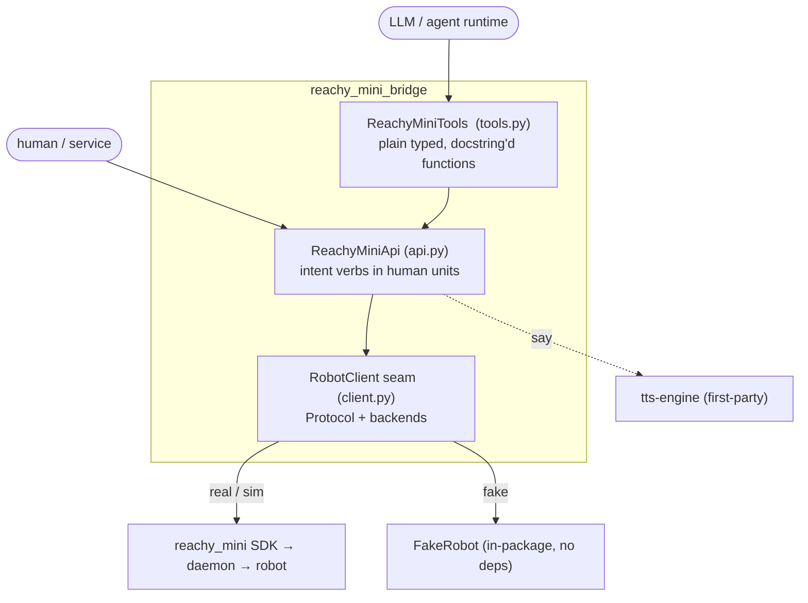

# Reachy Mini Bridge — overview

The global view of the project: what it is and how it's put together. For the list of specs and their status see [_index.md](_index.md); for the operating manual (status discipline, spec frontmatter, verification) see [AGENTS.md](../AGENTS.md).

Reachy Mini Bridge sits between the [Reachy Mini](https://github.com/pollen-robotics/reachy_mini) robot's API and the things that want to drive it — a human, a service, or an LLM/agent. It wraps the robot's native SDK, adds its own management and higher-level interaction APIs on top (mediating and orchestrating between the underlying endpoints), and exposes those as tools that let agents and LLMs perceive and control the robot. The core idea is a single, stable bridging layer so callers never talk to the raw robot API directly unless they choose to.

> **Status: design phase.** All three concept specs are `Draft` and no implementation exists yet — the `src/` modules are placeholders. This describes the intended shape, not shipped code.

## Architecture — three layers

Each layer is one module, one concept, one spec. Dependencies point downward; each layer only knows the one below it.

| Layer | Module · class | Role | Spec |
|---|---|---|---|
| 2 — agent tools | `tools.py` · `ReachyMiniTools` | The API exposed as plain, fully-typed, docstring'd functions an agent runtime can introspect and call. JSON-friendly in/out (frames as base64). | [tools.md](tools.md) |
| 1 — interaction API | `api.py` · `ReachyMiniApi` | Intent-level verbs in **human units** (degrees, seconds, named emotions): `look_at`, `nod`, `play_emotion`, `say`, `get_view`, … Orchestrates the low-level calls. | [api.md](api.md) |
| 0 — connection seam | `client.py` · `RobotClient` + adapters | A narrow `Protocol` we own, with three backends, isolating everything above from the heavy upstream SDK. Exposes `.raw` as an escape hatch to the full native API. | [client.md](client.md) |

## Three backends, one Protocol

The layers above are backend-agnostic — they only see `RobotClient` (see [client.md](client.md)):

- **`real`** *(default)* — adapter over `reachy_mini.ReachyMini`, talking to the daemon and hardware.
- **`sim`** — the same adapter with `use_sim=True`, driving the upstream MuJoCo mockup. Needs the `sim` extra (`reachy_mini[mujoco]`).
- **`fake`** — a first-party `FakeRobot` with no daemon, no hardware, no `reachy_mini` import. Records commands and returns synthetic perception. Powers the deterministic `tests/` tier and offline dev/demos.

## External pieces

- **[`reachy_mini`](https://github.com/pollen-robotics/reachy_mini)** — the upstream SDK we wrap. Hard runtime dependency, installed by default. What we learned about its API is in [../docs/reachy-mini-api.md](../docs/reachy-mini-api.md).
- **[`tts-engine`](../../tts-engine)** — our first-party streaming TTS engine, backing `ReachyMiniApi.say`. A local path dependency during development, a pinned git URL later.

## Tech stack

**Python 3.12+**, `src/` layout, managed with **`uv`**; **`ruff`** (lint/format), **`pyright`** (`standard`), **`pytest`** gate every change. Full tooling and dependency policy is in [project.md](project.md); the testing strategy in [testing.md](testing.md).

## Roadmap (next steps)

1. Settle the remaining `api.md` open questions (`say` audio routing, frame conventions) and promote specs `Draft` → `Stable`.
2. Build bottom-up: `client` (+ `FakeRobot`) → `api` → `tools`, each with its own implementation plan (indexed in [../plans/_index.md](../plans/_index.md)).
