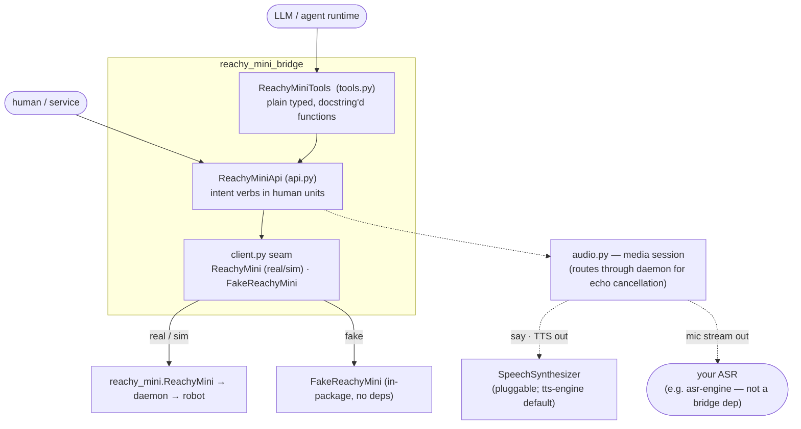

# Reachy Mini Bridge — overview

The global view of the project: what it is and how it's put together. For the list of specs and their status see [_index.md](_index.md); for the operating manual (status discipline, spec frontmatter, verification) see [AGENTS.md](../AGENTS.md).

Reachy Mini Bridge sits between the [Reachy Mini](https://github.com/pollen-robotics/reachy_mini) robot's API and the things that want to drive it — a human, a service, or an LLM/agent. It wraps the robot's native SDK, adds its own management and higher-level interaction APIs on top (mediating and orchestrating between the underlying endpoints), and exposes those as tools that let agents and LLMs perceive and control the robot. The core idea is a single, stable bridging layer so callers never talk to the raw robot API directly unless they choose to.

> **Status: design phase.** The concept specs (`client`, `api`, `audio`, `tools`) are `Draft` and no implementation exists yet — the `src/` modules are placeholders. This describes the intended shape, not shipped code.

## Architecture — three layers

Each layer is one module, one concept, one spec. Dependencies point downward; each layer only knows the one below it.

| Layer | Module · class | Role | Spec |
|---|---|---|---|
| 2 — agent tools | `tools.py` · `ReachyMiniTools` | The API exposed as plain, fully-typed, docstring'd functions an agent runtime can introspect and call. JSON-friendly in/out (frames as base64). | [tools.md](tools.md) |
| 1 — interaction API | `api.py` · `ReachyMiniApi` | Intent-level verbs in **human units** (degrees, seconds, named emotions): `look_at`, `nod`, `play_emotion`, `say`, `get_view`, … Orchestrates the low-level calls. | [api.md](api.md) |
| 0 — connection seam | `client.py` · `RobotClient` alias + `FakeReachyMini` | `real`/`sim` use `reachy_mini.ReachyMini` directly, `fake` is our in-package stand-in; `RobotClient` is just a `ReachyMini \| FakeReachyMini` union alias (no Protocol, no adapter) that lets pyright keep the fake honest. The robot object *is* the escape hatch to the full native API. | [client.md](client.md) |

## Three backends, one seam

The layers above are backend-agnostic — they are typed against `RobotClient`, the `ReachyMini | FakeReachyMini` union alias (see [client.md](client.md)):

- **`real`** *(default)* — the upstream `reachy_mini.ReachyMini` used directly (no wrapper), talking to the daemon and hardware.
- **`sim`** — the same `ReachyMini` constructed with `use_sim=True`, driving the upstream MuJoCo mockup. Needs the `sim` extra (`reachy_mini[mujoco]`).
- **`fake`** — a first-party `FakeReachyMini` with no daemon, no hardware, no `reachy_mini` import: a duck-typed stand-in that records commands and returns synthetic perception. Powers the deterministic `tests/` tier and offline dev/demos.

## External pieces

- **[`reachy_mini`](https://github.com/pollen-robotics/reachy_mini)** — the upstream SDK we wrap. Hard runtime dependency, installed by default. What we learned about its API is in [../docs/reachy-mini-api.md](../docs/reachy-mini-api.md).
- **[`tts-engine`](../../tts-engine)** — our first-party streaming TTS engine, the **default** (but swappable) backend for `ReachyMiniApi.say` behind the bridge-owned `SpeechSynthesizer` interface. Shipped under the optional `tts` extra — a local path dependency during development, a pinned git URL later.
- **[`asr-engine`](../../asr-engine)** — our first-party streaming ASR engine. **Not a bridge dependency.** The bridge exposes the robot's echo-cancelled microphone as a stream (see [audio.md](audio.md)) and a caller runs ASR on top; `asr-engine` is one natural choice a caller can attach in a few lines.

## Tech stack

**Python 3.12+**, `src/` layout, managed with **`uv`**; **`ruff`** (lint/format), **`pyright`** (`standard`), **`pytest`** gate every change. Full tooling and dependency policy is in [project.md](project.md); the testing strategy in [testing.md](testing.md).

## Roadmap (next steps)

1. Settle the remaining `api.md` open questions (`say` audio routing, frame conventions) and promote specs `Draft` → `Stable`.
2. Build bottom-up: `client` (+ `FakeReachyMini`) → `api` → `tools`, each with its own implementation plan (indexed in [../plans/_index.md](../plans/_index.md)).
