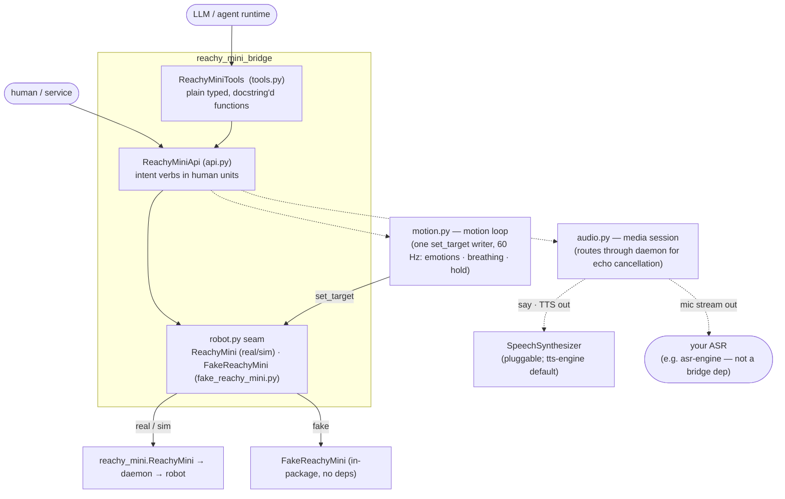

# Reachy Mini Bridge — overview

The global view of the project: what it is and how it's put together. For the list of specs and their status see [_index.md](_index.md); for the operating manual (status discipline, spec frontmatter, verification) see [AGENTS.md](../AGENTS.md).

Reachy Mini Bridge sits between the [Reachy Mini](https://github.com/pollen-robotics/reachy_mini) robot's API and the things that want to drive it — a human, a service, or an LLM/agent. It wraps the robot's native SDK, adds its own management and higher-level interaction APIs on top (mediating and orchestrating between the underlying endpoints), and exposes those as tools that let agents and LLMs perceive and control the robot. The core idea is a single, stable bridging layer so callers never talk to the raw robot API directly unless they choose to.

> **Status: layers 0–1 built, motion loop built (hardware check pending).** The connection seam (`robot`), the interaction API (`api`), and the audio/media session (`audio`) are built — the v1 conversational-presence slice (talk, listen, express, follow a face, read a camera frame, manage motors, stay visibly alive in between) runs on all three backends. The motion loop (`motion`: presence and breathing, emotions played through one target writer) is coded and passes lint/type-check/tests including the live sim tier; its [implementation plan](../plans/202609162000_motion-loop-presence-and-breathing.md) stays `In progress` until the on-robot checklist is walked, so `motion` reads `Stable` and `api` / `config` / `robot` read `Updated` until then. The agent-tools layer (`tools`) is still `Draft`. See [_index.md](_index.md) for per-spec status.

## Architecture — three layers

Each layer is one module, one concept, one spec. Dependencies point downward; each layer only knows the one below it.

| Layer | Module · class | Role | Spec |
|---|---|---|---|
| 2 — agent tools | `tools.py` · `ReachyMiniTools` | The API exposed as plain, fully-typed, docstring'd functions an agent runtime can introspect and call. JSON-friendly in/out (frames as base64). | [tools.md](tools.md) |
| 1 — interaction API | `api.py` · `ReachyMiniApi` | Intent-level verbs in **human units** (degrees, seconds, named emotions): `play_emotion`, `say`, `get_camera_frame`, … Orchestrates the low-level calls. Its two sessions: `audio.py` (media: speech out, mic in) and `motion.py` (the motion loop: the one writer of the robot's target, playing emotions and the idle behaviour — presence, breathing). | [api.md](api.md), [audio.md](audio.md), [motion.md](motion.md) |
| 0 — connection seam | `robot.py` · `AnyReachyMini` alias + `build_robot`; `fake_reachy_mini.py` · `FakeReachyMini` | `real`/`sim` use `reachy_mini.ReachyMini` directly, `fake` is our in-package stand-in; `AnyReachyMini` is just a `ReachyMini \| FakeReachyMini` union alias (no Protocol, no adapter) that lets pyright keep the fake honest. The robot object *is* the escape hatch to the full native API. | [robot.md](robot.md) |

## Design principles

- **One writer for motion, always alive.** The robot's target pose has exactly one writer: the motion loop ([motion.md](motion.md)), a 60 Hz thread that plays one primary move at a time (an emotion, later a gesture) and otherwise the idle move — breathing, or a still neutral — with every transition a short blend, so the robot never snaps and never goes dead between verbs. Face tracking and audio-reactive wobbling stay daemon-side and compose on top. Presence and breathing are switches, on by default.
- **Async-native, fully cancellable.** The api is `async` because audio forces it ([audio.md](audio.md)), and cancelling the awaiting task is the one way to interrupt any verb. Three guarantees, defined precisely in [api.md](api.md) "Cancellation": the cancel returns promptly; the verb's effect stops with it (audio flushed, a sound file stopped, a trajectory no longer commanded, the wobbler reset); and the robot and the session stay usable for the next verb. No rewind — the head stays where the cancel caught it. Every verb that spans time has a test on the `fake` that cancels it mid-flight, which is why the fake keeps real timing for those verbs.

## Three backends, one seam

The layers above are backend-agnostic — they are typed against `AnyReachyMini`, the `ReachyMini | FakeReachyMini` union alias (see [robot.md](robot.md)):

- **`real`** *(default)* — the upstream `reachy_mini.ReachyMini` used directly (no wrapper), talking to the daemon and hardware. For a robot plugged into this machine over USB, the bridge brings its hardware daemon up itself when asked (`daemon.spawn`), the same way as for `sim`.
- **`sim`** — the same `ReachyMini` constructed with `use_sim=True`, driving the upstream MuJoCo mockup. Needs the `sim` extra (`reachy_mini[mujoco]`). The bridge brings the MuJoCo daemon up itself when asked (`daemon.spawn` in [config.md](config.md), lifecycle in [daemon.md](daemon.md)) — own-it-or-borrow-it, headless by default, torn down on exit.
- **`fake`** — a first-party `FakeReachyMini` with no daemon, no hardware, no `reachy_mini` import: a duck-typed stand-in that records commands and returns synthetic perception. Powers the deterministic `tests/` tier and offline dev/demos.

## Configuration

`ReachyMiniApi` is constructed from one declarative `ReachyMiniConfig` ([config.md](config.md)) — backend, the upstream `ReachyMini` connection kwargs forwarded verbatim, daemon management, the tts-engine `engine` block for the default synthesizer, and the XVF3800 audio profile — buildable from a dict, a JSON string, or a JSON file (`ReachyMiniApi.from_json_file("robot.json")`), with `ReachyMiniApi("fake")` as the backend-string shorthand. It mirrors tts-engine's `TTSEngineConfig` so the two first-party libraries configure the same way, and one file switches real ↔ sim ↔ fake by changing `backend`.

## External pieces

- **[`reachy_mini`](https://github.com/pollen-robotics/reachy_mini)** — the upstream SDK we wrap. Hard runtime dependency, installed by default. What we learned about its API is in [../docs/reachy-mini-api.md](../docs/reachy-mini-api.md).
- **[`tts-engine`](../../tts-engine)** — our first-party streaming TTS engine, the **default** (but swappable) backend for `ReachyMiniApi.say` behind the bridge-owned `SpeechSynthesizer` interface. Shipped under the optional `tts` extra — a local path dependency during development, a pinned git URL later.
- **[`asr-engine`](../../asr-engine)** — our first-party streaming ASR engine. **Not a bridge dependency.** The bridge exposes the robot's echo-cancelled microphone as a stream (see [audio.md](audio.md)) and a caller runs ASR on top; `asr-engine` is one natural choice a caller can attach in a few lines.

## Tech stack

**Python 3.12+**, `src/` layout, managed with **`uv`**; **`ruff`** (lint/format), **`pyright`** (`standard`), **`pytest`** gate every change. Full tooling and dependency policy is in [project.md](project.md); the testing strategy in [testing.md](testing.md).

## Roadmap (next steps)

1. **Done:** `robot` (+ `FakeReachyMini`), then the coupled `api` + `audio` layer — the v1 verbs over a media session, with fast `tests/` and a capability-gated `tests-e2e/` tier.
2. **Done:** the config + daemon lifecycle ([config.md](config.md), [daemon.md](daemon.md)): the api is constructed from a `ReachyMiniConfig` (dict / JSON / file) and the bridge spawns or borrows the sim daemon — or a USB-attached robot's daemon — itself.
3. **In progress:** the motion loop ([motion.md](motion.md)) is coded — presence and breathing over one `set_target` writer, `play_emotion` moved onto it — and green through the live sim tier; only the [plan](../plans/202609162000_motion-loop-presence-and-breathing.md)'s on-robot checklist is outstanding, so the `api` / `config` / `robot` specs read `Updated` until that plan is `Done`.
4. **Next:** build the `tools` layer — the v1 api verbs exposed as plain typed, docstring'd functions for an agent/LLM runtime (settle `tools.md` `Draft` → `Stable`, then its implementation plan).
5. **Deferred (post-v1):** manual movement/gaze verbs (as primaries of the motion loop) and rich perception (see `api.md`), plus the hardware-tuning items in `audio.md` (the default XVF3800 profile, the full-duplex default) and `motion.md` (tick rate, blend duration).
